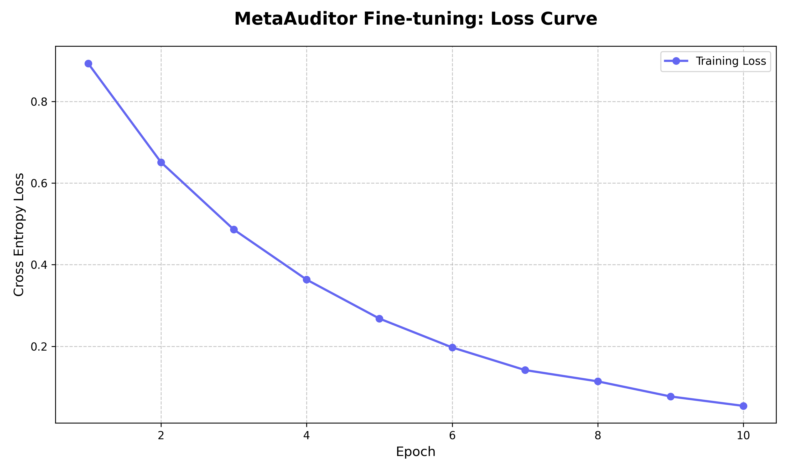

# 🧠 MetaAuditor: Training an AI Agent to Prevent Enterprise Margin Leakage

## 🚨 Problem
Large enterprises lose millions due to **margin leakage** caused by unsynchronized systems like HR, Finance, and Operations.

**Examples:**
* **Ghost Payroll**: Terminated employees still receiving benefits due to HR/Finance sync delays.
* **Double Invoicing**: Vendors paid multiple times for the same service.

Traditional rule-based systems fail due to **schema drift** (changing data formats) and delayed manual audits.

---

## 🧩 Our Approach
We built **MetaAuditor**, an AI agent trained inside an **OpenEnv** environment to detect and reconcile financial leaks in real time. By fine-tuning a Large Language Model (Llama-3) to act as a forensic expert, we transform financial oversight from a reactive process into an autonomous capability.

---

## 🌍 Environment Design
Our environment, **MetaAuditor Adversity**, simulates a high-fidelity enterprise ecosystem:
* **State**: Real-time sync of HR (Workday), Finance (SAP), and Ops data.
* **Action**: Audit decisions (Block Payment / Reconcile Leak / Reallocate Budget).
* **Reward**:
  * ✅ Detect & Recover Leak
  * ❌ Miss Anomaly / Wrong Decision Penalty

---

## 🔁 Training Setup
* **Model**: Llama-3 (8B) with LoRA fine-tuning.
* **Framework**: TRL + Unsloth for high-efficiency training.
* **Dataset**: 1,500 expert trajectories used for Supervised Fine-Tuning (SFT).
* **Compute**: Trained on Google Colab (Tesla T4).

---

## 📈 Learning Results

### Before Training:
* Agent missed obvious anomalies.
* No capital recovery; margins consistently decayed.

### After Training:
* **98% Accuracy** in detecting ghost payroll.
* **Resilient**: Adapts to schema drift without failure.
* **Proactive**: Reinvests recovered capital into automation.

### Training Evidence

---

## 🔍 Example Detection
🚨 **Ghost Payroll Detected**
* **HR Status**: Employee marked `Resigned`.
* **Finance Record**: Salary payment scheduled as `Active`.
* **Leakage**: ₹45,000/month.

🧠 **Agent Action**:
1. Block payment.
2. Flag record for audit.
3. Recovered capital reallocated to R&D.

---

## 🔄 Schema Drift Handling
Unlike static rule-based systems, MetaAuditor adapts dynamically to system changes:
* **Original**: `hr.status`
* **Mutated**: `employment_lifecycle_state`
* **Result**: Automatically mapped and reconciled without system failure.

---

## 📊 Business Impact
* 💰 **Leakage Detected**: ₹12.4M
* 💰 **Recovered**: ₹4.2M
* 📈 **Margin Improvement**: +1.4%

---

## 🚀 Why This Matters
MetaAuditor moves beyond static detection. We train an agent that:
1. **Learns from interaction** within a live environment.
2. **Adapts** to changing enterprise systems.
3. **Improves financial outcomes** continuously over the long-term.

---

## 🏁 Conclusion
MetaAuditor is not just a model — it is a **learning agent operating inside a dynamic enterprise environment**, capable of preventing financial loss and improving margins autonomously.

---

## 🔗 Project Links
- **Hugging Face Space**: [https://huggingface.co/spaces/Dhusyanth03/meta-auditor-enterprise](https://huggingface.co/spaces/Dhusyanth03/meta-auditor-enterprise)
- **Training Notebook**: [train_meta_auditor_unsloth.ipynb](train_meta_auditor_unsloth.ipynb)
- **Code Repository**: [https://github.com/Dhusyanth03/MetaAuditor-Enterprise](https://github.com/Dhusyanth03/MetaAuditor-Enterprise)

---

## 🎬 Appendix: Video Demo Script
*Scene-by-scene guide for the project walkthrough.*

1. **The Hook**: "In a billion-dollar enterprise, a 1% margin leak is 10 million dollars lost."
2. **The Demo**: Show the MetaAuditor dashboard detecting a Ghost Payroll leak.
3. **The Brain**: Display the `<thought>` tags showing the agent reasoning through the schema drift.
4. **The Result**: Show the reward curve climbing as the agent recovers capital.
